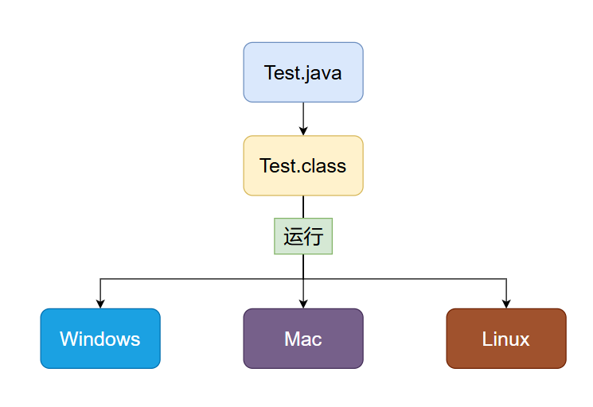
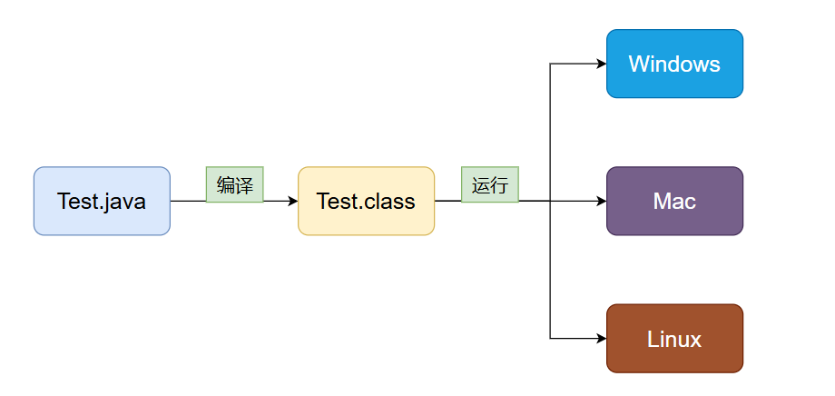
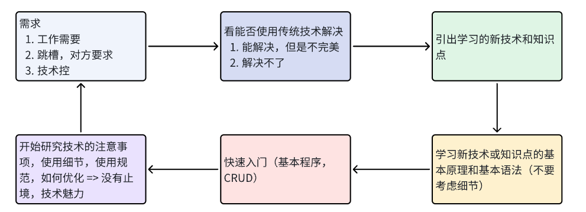
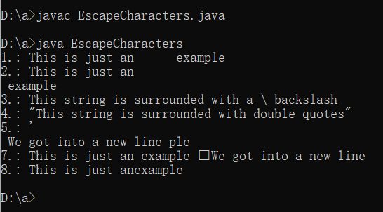
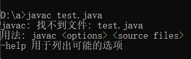
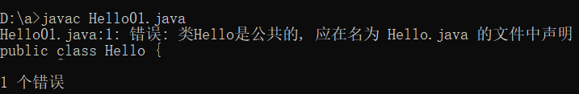
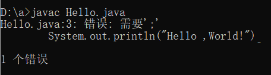
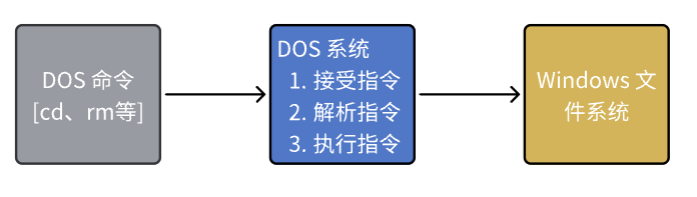

# 我的 Java 学习博客

欢迎来到我的学习记录博客！  
这里是我的学习日志❤

## 1. Java概述
  
#### 1.1 什么是程序？
  计算机执行某些操作或解决某个问题而编写的一系列有序指令的集合 
  
#### 1.2 Java 技术体系平台

| 版本   | 描述 | 中文描述 |
|------|------|------|
| Java SE | (Java Standard Edition) 标准版 | 支持面向桌面级应用（如 Windows 下的应用程序）的 Java 平台，提供了完整的 Java 核心 |
| Java EE | (Java Enterprise Edition) 企业版 | 是为开发企业环境下的应用程序提供的一套解决方案。该技术体系中包含的技术如：Servlet、JSP 等，主要针对于 Web 应用程序开发。版本以前称为 J2EE |
| Java ME | (Java Micro Edition) 小型版 | 支持 Java 程序运行在移动终端（手机、PDA）上的平台，对 Java API 有所精简，并加入了针对移动终端的支持，此版本以前称为 J2ME |

#### 1.3 Java 重要特点
- Java 语言是面向对象的（oop）
- Java 语言是健壮的
- Java 的强类型机制、异常处理、垃圾的自动收集等是 Java 程序健壮性的重要保证
- Java 语言是跨平台性的
  > 一个编译好的 .class 文件可以在多个系统下运行，这种特性称为跨平台
  > 
- Java 语言是解释型的（了解）
  - 解释性语言：JavaScript、PHP、Java
  - 编译性语言：C/C++
  - 区别：解释性语言，编译后的代码不能直接被机器运行，需要解释器来执行；编译性语言，编译后的代码，可以直接被机器执行

#### 1.4 Java 的开发工具
- editplus、notepad++
- Sublime Text
- IDEA
- eclipse
  
#### 1.5 如何选择开发工具？
- 先选择使用文本编辑本 Sublime Text，对 Java 有一定了解后，再使用 IDEA、Eclipse 开发工具。这样更深刻的理解 Java 技术，培养代码感（面试往往手写代码）

#### 1.6 Java 运行机制及运行过程
> 核心机制 - Java虚拟机【JVM Java Virtual Machine】
- 基本介绍
    - JVM 是一个虚拟的计算机，具有指令集并使用不同的存储区域。负责执行指令，管理数据、内存、寄存器，包含在 JDK 中
    - 对于不同的平台，有不同的虚拟机
    - Java 虚拟机机制屏蔽了底层运行平台的差别，实现了 一次编译，到处运行
      >
      > - 编译指令 ： `javac` 
      > - 执行指令 ： `java`
        
#### 1.7 什么是 JDK、JRE

|  | 全称                                                                                                                                                                                                 | 介绍                                                                                                                                                           |
|----|----------------------------------------------------------------------------------------------------------------------------------------------------------------------------------------------------|--------------------------------------------------------------------------------------------------------------------------------------------------------------|
| JDK | Java Development Kit，Java 开发工具包                               | - JDK = JRE + Java 的开发工具【java、javac、javadoc、javap 等】<br>- JDK 是提供给 Java 开发人员使用的，其中包含了 Java 的开发工具，也包括了 JRE，所以安装了 JDK ，就不用再单独安装 JRE                            |
| JRE | Java Runtime Environment，Java 运行环境 | - JRE = JVM + Java 的核心类库<br>- 包括 Java 虚拟机 (JVM) 和 Java 程序所需的核心类库等，如果想要运行一个开发好的 Java 程序，计算机中只需要安装 JRE 即可 |

> - JDK = JRE + 开发工具集 
> - JRE = JVM + Java SE 标准类库
  
#### 1.8 下载安装 JDK
- 安装：[参考视频](https://www.bilibili.com/video/BV1fh411y7R8?spm_id_from=333.788.videopod.episodes&vd_source=77a978b6128500186946ad5865d218ca&p=13)
- 配置环境变量：[参考视频](https://www.bilibili.com/video/BV1fh411y7R8?spm_id_from=333.788.videopod.episodes&vd_source=77a978b6128500186946ad5865d218ca&p=14)
- 测试：Win + R => 输入 cmd => 回车 => 输入 java -version => 回车，看到 Java 版本信息【完成✌】
  
> 为什么要配置 PATH：[参考解释](https://blog.csdn.net/Fly_1213/article/details/101750887) 
> <br>Java 程序的运行：先使用 `javac` 编译指令 编译成字节码文件， 然后使用 `java` 执行指令 解释并运行字节码文件，而 Windows 运行 编译命令 `javac` 或者执行指令 `java` 的时候，本地查找不到某个命令或文件，就会到 path 中去查找
  我们不可能在每个 Java 文件所在目录放置 JDK ，故把 JDK 放置 path 环境变量中，这样每个 java 文件都可以通过 path 中设定的 jdk 目录找到编译命令进行编译
  
#### 1.9 Java 快速入门
- 需求：要求开发一个 Hello.java 程序，可以输出 "Hello ,World!"
  
- 开发步骤
  1. 将 Java 代码编写到扩展名为 Hello.java 的文件中
  2. 通过 javac 命令对该 java 文件进行编译，生成 .class 文件
  3. 通过 java 命令对生成的 .class 文件进行运行
    ```java
       /**
         * 1. public class Hello 表示 Hello 是一个 public 公有的类
         * 2. Hello {} 表示一个类的开始和结束
         * 3. public static void main(String[] args) 表示一个主方法，即程序的入口
         * 4. main() {} 表示方法的开始和结束
         * 5. System.out.println("hello,world!"); 表示输出 "hello,world!" 到屏幕
         * 6. ; 表示语句结束
         */
         public class Hello {
             public static void main(String args[]) {
                 // 输出 Hello,World!
                 System.out.println("Hello ,World!");
             }
         }
    ```

#### 1.10 Java 开发快速入门
```java
public class Hello {
    public static void main(String args[]) {
        // 输出 Hello,World!
        System.out.println("Hello ,World!");
    }
}

/**
  * 一个源文件中最多只能有一个 public 类，其他类的个数不限
  * HappyDog 是一个类
  * 编译后，每一个类，都对应一个 .class
  * 例如这个 .java 文件执行 `javac` 编译后会生成三个 .class 文件
  */
class HappyDog {
    public static void main(String args[]) {
        // 输出 HappyDog!
        System.out.println("HappyDog!");
    }
}

class CuteCat {
    public static void main(String args[]) {
        // 输出 CuteCat!
        System.out.println("CuteCat!");
    }
}
```
1.11 Java 开发注意事项和细节说明
- Java 源文件以 .java 为扩展名。源文件的基本组成部分是类（class），如上述例子中的 Hello 类
- Java 应用程序的执行入口是 main() 方法。它有固定的书写格式：public static void main(String args[])
- Java 语言严格区分大小写 
- Java 方法由一条条语句构成，每个语句以 “;” 结束 
- 大括号都是成对出现的，缺一不可（先写 {} 再写代码） 
- 一个源文件中最多只能有一个 public 类，其它类的个数不限 
- 如果源文件包含一个 public 类，则文件名必须按该类名命名 
- 可以将 main 方法写在非 public 类中，然后指定运行非 public 类，这样入口方法就是非 public 的 mian 方法
   
#### 1.12 如何快速掌握技术或知识点
   
   
#### 1.13 Java 转义字符
转义字符是一些有特殊意义的字符，用来表示常见的不能显示的字符

| 转义序列 | 说明 | 用法 |
|----------|------|------|
| `\t`     | 制表符 | 在使用它的地方会在文本中插入一个制表符或一个大空格 |
| `\n`     | 换行符 | 在文本中使用它的地方插入了一个新行 |
| `\\`     | 反斜杠字符 | 插入或转义文本中的反斜杠 |
| `\"`     | 双引号 | 插入或转义一个双引号 |
| `\'`     | 单引号 | 插入或转义一个单引号 |
| `\r`     | 回车 | 在使用它的地方插入一个回车 |
| `\b`     | 退格键 | 插入了一个退格，或者可以说它删除了后面的字符 |
| `\f`     | 换页 | 在文本的使用点插入一个换页符（现在很少使用） |

```java
// This is a test for escaping characters
public class EscapeCharacters {
    public static void main(String[] args) {
        String tabExample = "This is just an \t example";
        String newLineExample = "This is just an \n example";
        String backslashExample = "This string is surrounded with a \\ backslash ";
        String doubleQuotesExample = "\"This string is surrounded with double quotes\"";
        char singleQuoteExample = '\'';
        String carriageReturnExample = "This is just an example \r We got into a new line ";
        String formFeedExample = "This is just an example \f We got into a new line ";
        String backspaceExample = "This is just an \bexample";
        
        System.out.println("1.: " + tabExample);
        System.out.println("2.: " + newLineExample);
        System.out.println("3.: " + backslashExample);
        System.out.println("4.: " + doubleQuotesExample);
        System.out.println("5.: " + singleQuoteExample);
        System.out.println("6.: " + carriageReturnExample);
        System.out.println("7.: " + formFeedExample);
        System.out.println("8.: " + backspaceExample);    
    }
}
```

   
#### 1.14 初学 Java 易犯错误
1. 找不到文件
<br>

2. 主类名和文件名不一致
<br>
3. 缺少分号
<br>
4. 常见错误总结
   学习编程最容易烦的错是语法错误（初学者）Java要求必须按照语法规则编写代码。如果程序违反了语法规则，例如：忘记分号、大括号、引号，或者拼错单词，Java 编译器都会报语法错误。尝试去看懂编译器会报告的错误信息
   - `1` - `l`
   - `0` - `o`
   - 中英文的 `；` `;` `“”` `""`
   - `void` - `viod`
   
   > 不好修改的错误其实是业务错误，环境错误

#### 1.15 注释

- 用于注解说明解释程序的文字就是注释，注释提高了代码的阅读性（可读性）
- 注释是一个程序员必须要具有的良好编程习惯
- 将自己的思想通过注释先整理出来，再用代码去体现
  
  | 注释类型 | 语法 |
  |----------|------|
  | 单行注释 | `//` |
  | 多行注释 | `/* */` |
  | 文档注释 | `/** */` |
 
  ```java
  //这是一个单行注释
  
  /* 这是多行注释
  多行注释1
  多行注释2
  多行注释3
  多行注释… */
  
  /**
   * 这是一个文档注释
   * 注释1
   * 注释2
   */
  ```

#### 1.16 Java 代码规范
* 类、方法的注释，要以 Java Doc 的方式来写
* 非 Java Doc 的注释，往往是给代码的维护者看的，着重告诉读者为什么这样写，如何修改，注意什么问题等
* tab：向右缩进；shift + tab：向左缩进
* 运算符和 = 两边习惯性各加一个空格。比如：2 + 4 * 5 = 22
* 源文件使用 UTF-8 编码
* 行宽度不要超过 80 字符
* 代码编写次行风格和行尾风格 (!!)

```java
// 行尾风格
public static void main(String args[]) {
  ……
  if (a > b) {
    System.out.println("早上好");
  } else {
    System.out.println("晚上好");
  }
}

// 次行风格
public static void main(String args[])
  {
  ……
  if (a > b)
  {
    System.out.println("早上好");
  } else
  {
    System.out.println("晚上好");
  }
}
```

- Java Doc 标签

  | 标签描述 | 语法 | 示例 |
  |----------|------|------|
  | `@author` | 标识一个类的作者 | `@author John Doe` |
  | `@deprecated` | 指名一个过期的类或成员 | `@deprecated This method is deprecated and will be removed in future versions` |
  | `@since` | 标记当引入一个特定的变化时 | `@since 1.0` |
  | `@version` | 指定类的版本 | `@version 1.0` |
  | `@param` | 说明一个方法的参数 | `@param parameter-name explanation` |
  | `@return` | 说明返回值类型 | `@return explanation` |
  | `@throws` | 标志一个类抛出的异常 | `@throws Exception explanation` |
  | `@see` | 指定一个到另一个主题的链接 | `@see AnotherClass` |
  | `@value` | 显示常量的值，该常量必须是static属性 | `@value "constant value"` |
  | `@exception` | 和 `@throws` 标签一样 | `@exception Exception explanation` |
  | `@serial` | 说明一个序列化属性 | `@serial "description"` |
  | `@serialData` | 说明通过 writeObject() 和 writeExternal() 方法写的数据 | `@serialData "description"` |
  | `@serialField` | 说明一个ObjectStreamField组件 | `@serialField name type description` |
  | `@docRoot` | 指明当前文档根目录的路径 | `@docRoot "path"` |
  | `@inheritDoc` | 从直接父类继承的注释 | `@inheritDoc` |
  | `@link` | 插入一个到另一个主题的链接 | `@link AnotherClass "text"` |
  | `@linkplain` | 插入一个到另一个主题的链接，但是该链接显示纯文本字体 | `@linkplain AnotherClass "text"` |

#### 1.17 DOS 命令（了解）
- DOS：Disk Operating System 磁盘操作系统 
- DOS 基本原理：
  

- 相对路径、绝对路径
  - 相对路径：从当前目录开始定位，形成的路径
  - 绝对路径：从顶级目录(c/d) 开始定位，形成的路径
  - 例子：
      - 文件结构
          - d盘 => test1、test2
          - test1 => test11、test12
          - test2 => test21、test22
          - test22 => Hello.txt
      - 问题：从 test11 文件夹访问 Hello.txt
          - 相对路径：..\..\test2\test22\Hello.txt
          - 绝对路径：d:\test2\test22\Hello.txt

- 常用 dos 命令

    | 命令 | 描述 |
    |------|------|
    | `dir` | 查看当前目录 |
    | `cd` | 切换到其他盘 |
    | `tree` | 查看指定的目录下所有的子级目录 |
    | `cls` | 清屏 |
    | `exit` | 退出 DOS |
    | `md` | 创建目录 |
    | `rd` | 删除目录 |
    | `copy` | 拷贝文件 |
    | `del` | 删除文件 |
    | `echo` | 输入内容到文件 |
    | `type` | 显示文件内容 |
    | `move` | 剪切 |


